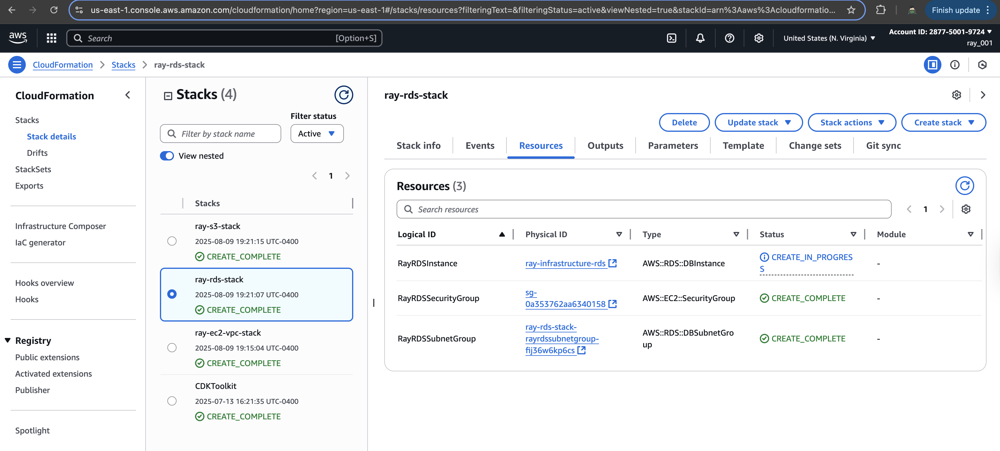
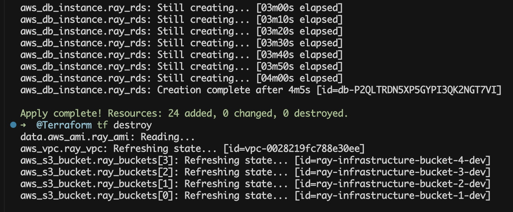

# AWS Infrastructure Automation Project

## Overview

This project deploys AWS infrastructure using Terraform and CloudFormation with S3, EC2, and RDS resources.

## CloudFormation



## Terraform



## Prerequisites

- AWS CLI configured
- Terraform installed
- AWS account with permissions for S3, EC2, VPC, RDS

## Quick Start

### Terraform Deployment

```bash
cd @Terraform
terraform init
terraform plan
terraform apply
```

### CloudFormation Deployment

**Important**: Deploy stacks in this order due to dependencies:

```bash
# 1. Deploy EC2 and VPC first (creates VPC and subnets)
aws cloudformation create-stack \
  --stack-name ray-ec2-vpc-stack \
  --template-body file://@CloudFormat/ec2-vpc.yaml \
  --parameters ParameterKey=RayProjectName,ParameterValue=ray-infrastructure \
               ParameterKey=RayEnvironment,ParameterValue=dev \
               ParameterKey=RayInstanceType,ParameterValue=t2.micro

# 2. Deploy RDS (depends on VPC/subnets from EC2 stack)
aws cloudformation create-stack \
  --stack-name ray-rds-stack \
  --template-body file://@CloudFormat/rds-instance.yaml \
  --parameters ParameterKey=RayProjectName,ParameterValue=ray-infrastructure \
               ParameterKey=RayEnvironment,ParameterValue=dev \
               ParameterKey=RayDBName,ParameterValue=ray_db \
               ParameterKey=RayDBUsername,ParameterValue=ray \
               ParameterKey=RayDBPassword,ParameterValue=ray_pwd_123!

# 3. Deploy S3 buckets (independent)
aws cloudformation create-stack \
  --stack-name ray-s3-stack \
  --template-body file://@CloudFormat/s3-buckets.yaml \
  --parameters ParameterKey=RayProjectName,ParameterValue=ray-infrastructure \
               ParameterKey=RayEnvironment,ParameterValue=dev
```

**Important:** CloudFormation stacks must be deployed in this order:

1. **EC2-VPC stack first** (creates VPC and subnets)
2. **RDS stack second** (depends on subnet outputs from EC2-VPC)
3. **S3 stack** (independent, can be deployed anytime)

## Resources Created

### Terraform

- 4 private S3 buckets with versioning
- Custom VPC with 2 public subnets across different AZs (us-east-1a, us-east-1b)
- EC2 instance with public IP (deployed in us-east-1a)
- MySQL RDS instance (db.t3.micro) with multi-AZ subnet group

### CloudFormation

- 3 private S3 buckets with versioning
- VPC with 2 public subnets across different AZs (us-east-1a, us-east-1b)
- EC2 instance with public IP (deployed in us-east-1a)
- MySQL RDS instance with public access (spans multiple AZs)

## Architecture

### Multi-AZ Design

- **VPC:** Single VPC with CIDR 10.0.0.0/16
- **Subnet 1:** 10.0.1.0/24 in us-east-1a (EC2 deployment)
- **Subnet 2:** 10.0.2.0/24 in us-east-1b (RDS multi-AZ requirement)
- **Internet Gateway:** Provides internet access to both subnets
- **Route Tables:** Both subnets route to internet via IGW

### RDS Compliance

- RDS requires minimum 2 Availability Zones
- Subnet group spans both us-east-1a and us-east-1b
- Ensures high availability and meets AWS requirements

## Configuration

- Local Terraform state storage
- Dynamic AMI selection for EC2
- Proper security group configurations

## Cleanup

```bash
# Terraform
terraform destroy

# CloudFormation
aws cloudformation delete-stack --stack-name ray-s3-stack
aws cloudformation delete-stack --stack-name ray-ec2-vpc-stack
aws cloudformation delete-stack --stack-name ray-rds-stack
```
